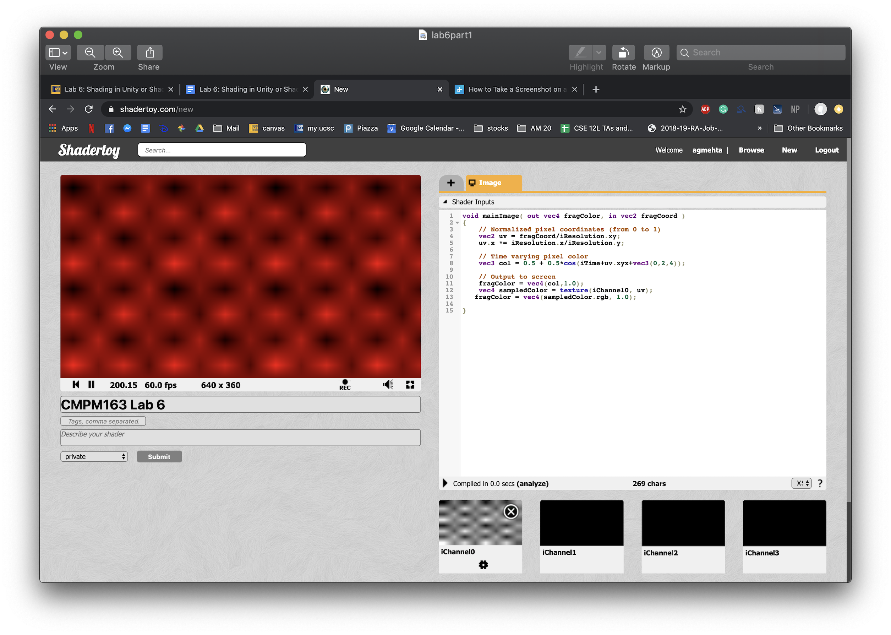
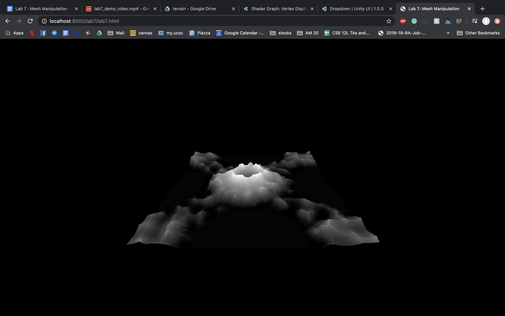
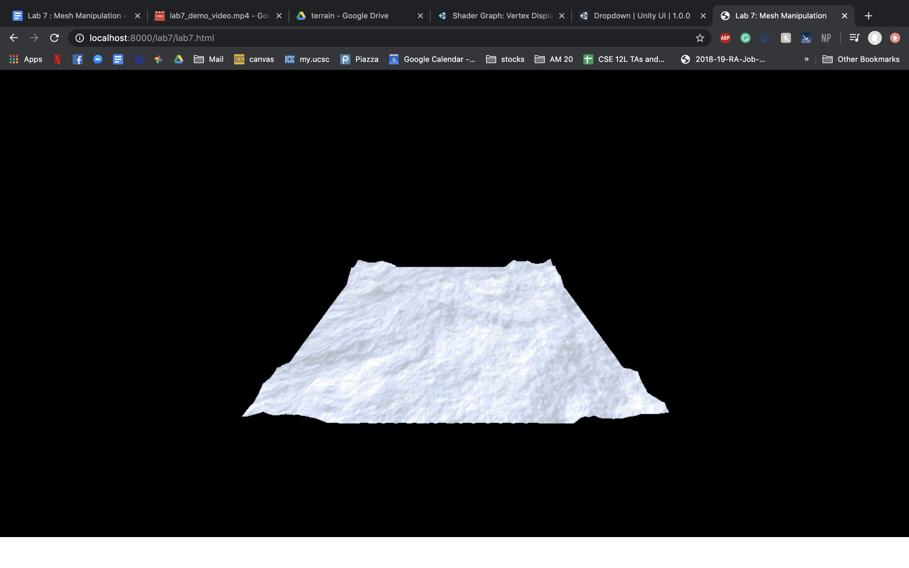

# CMPM163Labs
Lab2
https://drive.google.com/file/d/1QYKeJLO3ViBexm9sDF_cHSVOLWtTnCoI/view?usp=sharing

Lab3

https://drive.google.com/file/d/1eXeT12Woxa9z_oUJKzS7l_4he48FfoA5/view?usp=sharing
The cube on the very left is made from a MeshLambert material. I made a new cube variable and new material variable to create cube2, out of the Lambert material. I made the color pink and the emissive blue causing a purplish tinge on the cube and one side becoming blue when facing the light.

 The second cube from the left is the one from the lab assignment. This is made out of a mesh Phong Material and gets a green tinge when facing the light due to the specular being set to green. The color of the cube is grey causing the main color on the cube to be grey.

The third cube is also one from the lab assignment using fragment and vertex shaders. These shaders causes the corner to be shaded. The gl_fragcolor in my fragment shader file mixes the two colors together to give this shaded look of the blue color and the aquamarine color.

The fourth cube I made a new FragmentShader file with the colors colorc and color d instead. These colors I set to a magenta color and red color that made the magenta tinge when facing the light. I also used the gl_fragcolor in my fragmentshader2 file to mix the two colors together.

Lab4
https://drive.google.com/file/d/1ovMPJS_j1-i6mCHQDBTKwKwXFQ2aFOSn/view?usp=sharing
What is a formula to get the x coordinate of the texture given a u value of the uv coordinate (a value between 0 and 1)? 1
What is a formula to get the y coordinate of the texture given a v value of the uv coordinate (a value between 0 and 1)?0
What color is sampled from the texture at the uv coordinate (0.375, 0.25)? (sample from the image based on the number your formula gives you i.e. (1, 0) (x, y) is blue) - white
The cube on the left is using a meshphong material with the texture and norm named 171. It uses a normMap.
The next cube also uses a a meshPhongMaterial but withouth the normalMap. It has the same gemoetry and material.
The next cube uses a normMap and texture. I loaded a new material2 and added it to the scene.
The fourth cube uses the fragment and vertex shaders to give it a more 3d look. I used the uniforms and different shaders to create a new mesh.
My last cube would not show up but I tried to use the built in shader and use the texture 2d line.

Lab5
https://drive.google.com/file/d/1gxHX3DYdCy_nmC2PyHFCAqWPBPvNHx_X/view?usp=sharing
I first learned how to change colors. I changed the kartbody to blue and the KartWheels to purple by changing the albedo. I also the wheel a metallic alpha source and increased the smoothness to a 1. I did all this in the inspector when I clicked on components. The second thing I did was create the particles. That I followed the tutorial and made a new particle. Then I messed around with the gravity and color, and attached it to the kart by putting the particle file in the kart file. The particles now move with the kart.

Lab6
my lab: https://www.shadertoy.com/view/wdBfzR  (had to use a name without spaces because it wouldn't save)
cool link: https://www.shadertoy.com/view/3slcWr

lab7

