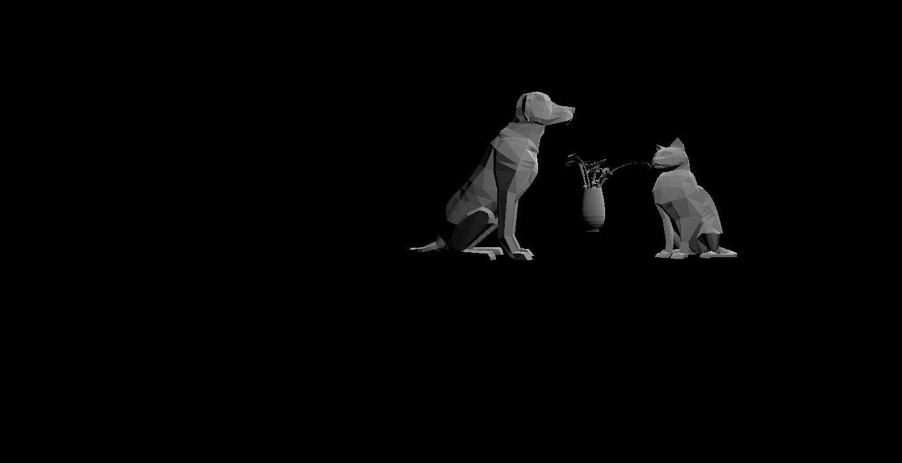

# CMPM163Labs
Lab2
https://drive.google.com/file/d/1QYKeJLO3ViBexm9sDF_cHSVOLWtTnCoI/view?usp=sharing

Lab2
https://drive.google.com/file/d/1eXeT12Woxa9z_oUJKzS7l_4he48FfoA5/view?usp=sharing
The cube on the very left is made from a MeshLambert material. I made a new cube variable and new material variable to create cube2, out of the Lambert material. I made the color pink and the emissive blue causing a purplish tinge on the cube and one side becoming blue when facing the light.

 The second cube from the left is the one from the lab assignment. This is made out of a mesh Phong Material and gets a green tinge when facing the light due to the specular being set to green. The color of the cube is grey causing the main color on the cube to be grey.

The third cube is also one from the lab assignment using fragment and vertex shaders. These shaders causes the corner to be shaded. The gl_fragcolor in my fragment shader file mixes the two colors together to give this shaded look of the blue color and the aquamarine color.

The fourth cube I made a new FragmentShader file with the colors colorc and color d instead. These colors I set to a magenta color and red color that made the magenta tinge when facing the light. I also used the gl_fragcolor in my fragmentshader2 file to mix the two colors together.
